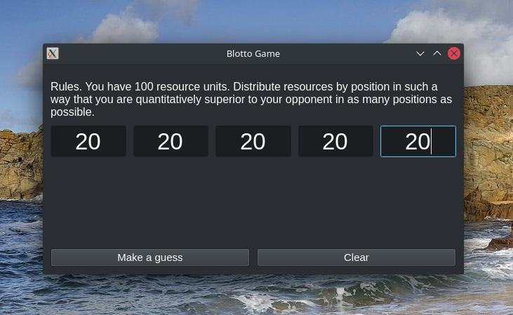
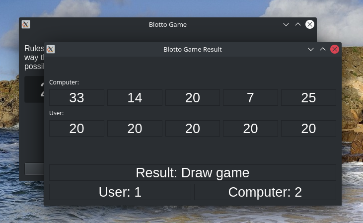

# Colonel Blotto Game

A Colonel Blotto game is a type of two-person constant-sum 
game in which the players (officers) are tasked to 
simultaneously distribute limited resources over several 
objects (battlefields).

In the classic version of the game, the player devoting 
the most resources to a battlefield wins that battlefield, 
and the gain (or payoff) is equal to the total number of 
battlefields won.

[More Details](https://en.wikipedia.org/wiki/Blotto_game) 
| [Game Theory](https://olympgame.hse.ru/data/2017/11/13/1158230288/Игра%20полковника%20Блотто.pdf)